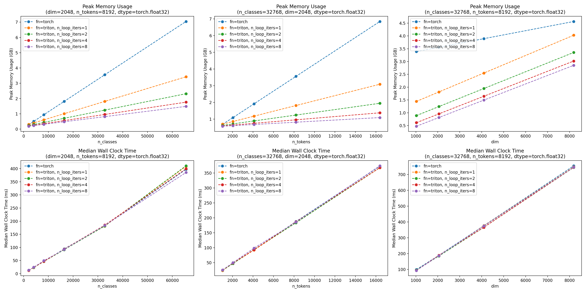

# Memory-Efficient Cross Entropy Loss

## TL;DR

This repo contains an implementation of a linear projection + cross-entropy loss PyTorch module that has substantially lower memory consumption compared to a standard implementation, with almost no additional compute cost. The memory savings come from two optimizations: 1) overwriting the logits with their gradients in-place and 2) not materializing the entire logits tensor.

## Overview

In networks trained to perform classification tasks, such as language models, the final layer is generally a linear projection from `dim` channels to `n_classes` channels to compute the logits, followed by cross-entropy loss. When `n_classes` is large relative to `dim`, the logits consume a large amount of GPU memory compared to other activations in the network. For example, [Mistral 7B](https://arxiv.org/abs/2310.06825) has a vocabulary size of 32,000 compared to much lower hidden dimension of 4096, so the logits take up roughly 8x as much GPU memory as the preceding activations.

This repo contains two optimizations to reduce the memory usage of a linear projection followed by cross-entropy loss, implemented in PyTorch + Triton. These optimizations primarily focus on reducing the memory usage of the logits tensor and its gradient since these tensors can dominate overall memory usage:
* **Optimization 1**: Overwrite the logits tensor with its gradient in-place to avoid allocating more memory for the gradients
* **Optimization 2**: Compute the loss and gradients in a loop of $K$ micro-batches **in the forward pass** so that we only materialize $\frac{1}{K}$ of the full logits tensor

These optimizations can reduce peak memory usage of a linear projection + cross-entropy loss by several times with almost no additional compute cost.

## Performance Analysis

Figure 1 plots the peak memory usage (top row) and median wall clock time (bottom row) before and after applying these optimizations.

**Figure 1 (generated by running `python ./benchmark.py`)**

### Optimization 1: Overwrite logits with their gradients

During the backward pass of a linear projection + cross-entropy loss module, we no longer need to keep the logits in memory after computing their gradients. So, we overwrite the logits in-place with their gradients in the backward pass to avoid allocating any new memory for the gradients.

The memory savings from this optimization are (approximately) represented by the difference between the blue line (without this optimization) and orange line (with this optimization) in Figure 1, above.

### Optimization 2: Avoid materializing full logits tensor

To avoid materializing the full logits tensor, we split the batch into $K$ micro-batches. Then, we can compute both the loss and the logit gradients (up to a scale factor) during the forward pass. With the logit gradients, we can compute the gradients w.r.t the input features and linear projection weights. This way, we do not need to materialize the entire logits tensor - we materialize $\frac{1}{K}$ of the logits at a time, compute the gradients we need, then discard those logits. Note that this requires no additional recomputation since this is all done in the forward pass.

The reason we can compute the logit gradients in the forward pass is that the output of this module is a scalar (since we assume we will do either a `mean` or `sum` reduction on the loss). Therefore, to get the correct gradients in the backward pass, we can simply multiply the gradients we computed in the forward pass by the `grad_output` scalar.

The top row in Figure 1 shows the memory savings from this optimization for different values of $K$ (`n_loop_iters` in Figure 1 refers to the number of microbatches $K$). In the bottom row of Figure 1, we can see that the median wall clock time is nearly identical before vs after these optimizations.

Note that we see diminishing returns in peak memory usage as we scale the hidden dim (`dim`). This is because peak memory usage becomes determined by the size of the linear projection's weights & gradients, rather than the logits, once the hidden dim is sufficiently large (right column in Figure 1).
